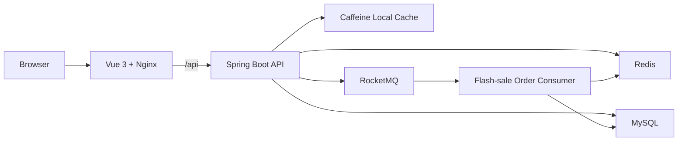
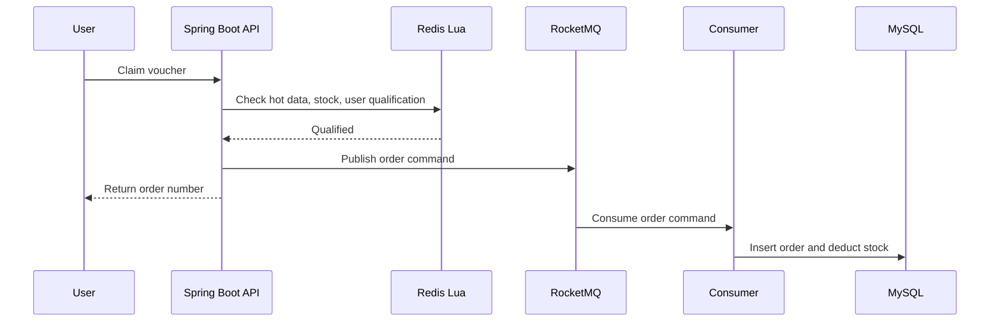
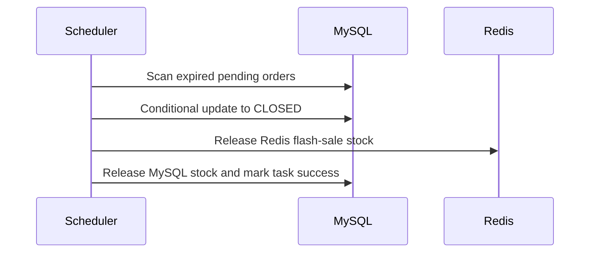

# Architecture Notes

[Back to README](README.md)

Life Service follows a modular monolith style. The backend is organized by
business capability, while infrastructure modules provide shared concerns such
as cache, ID generation, rate limiting, logging, and authentication.

## Runtime View



## Main Modules

| Module | Responsibility |
| --- | --- |
| `common` | API response, exception mapping, request trace, authentication context |
| `infrastructure.cache` | Redis/Caffeine cache helpers, invalidation, retry compensation |
| `infrastructure.ratelimit` | Annotation based sliding-window rate limit |
| `merchant` | Merchant category, merchant list, merchant detail query |
| `voucher` | Voucher query and flash-sale hot data warmup |
| `order` | Flash-sale ordering, async consumer, auto close, payment, stock release |
| `user` | Email login, Redis token, current user, logout |

## Flash-sale Order Flow



The request path is intentionally kept away from MySQL for flash-sale
qualification. If required Redis hot data is missing, the endpoint fails closed
instead of falling back to database queries during peak traffic.

## Cache Consistency

For read-heavy and rarely updated data such as merchants and vouchers, the
system uses cache-aside:

```text
read: local cache -> Redis -> database -> cache backfill
write: update database -> delete local/Redis cache
delete failure: write local retry task -> scheduled compensation
```

This is a pragmatic choice for a single-service scaffold. It avoids the
operational complexity of Canal or a dedicated cache invalidation message queue,
while still keeping eventual consistency through retry tasks and TTL.

## Order Close Flow



The close and payment flows use conditional database updates to avoid state
overwrite. If stock release fails, a retry task remains for later compensation.

## Deployment Shape

The root `compose.yaml` starts:

- MySQL
- Redis
- RocketMQ NameServer
- RocketMQ Broker
- Spring Boot backend
- Vue frontend served by Nginx

See [DEPLOYMENT.md](DEPLOYMENT.md) for local startup and image-based deployment.
