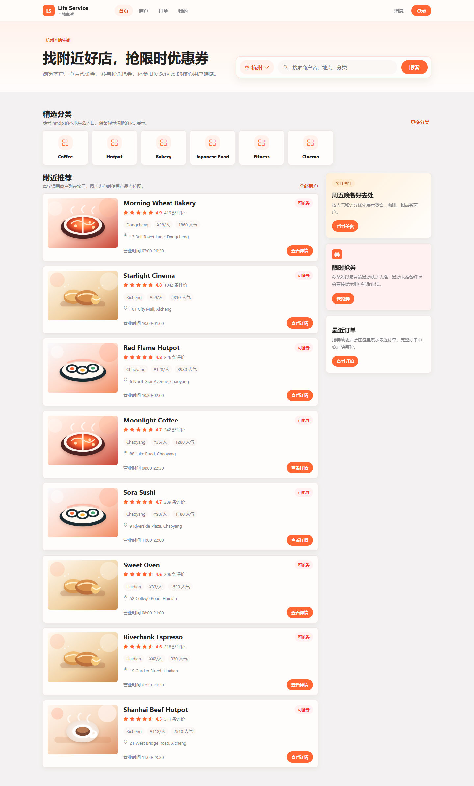
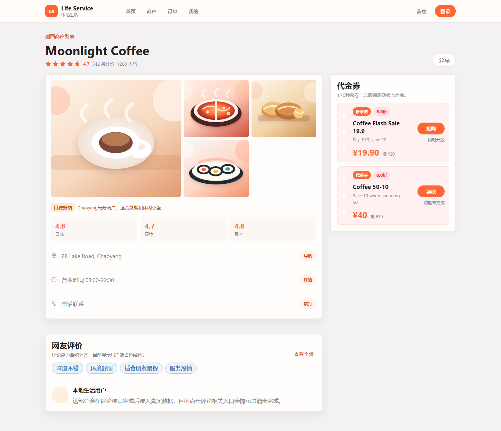
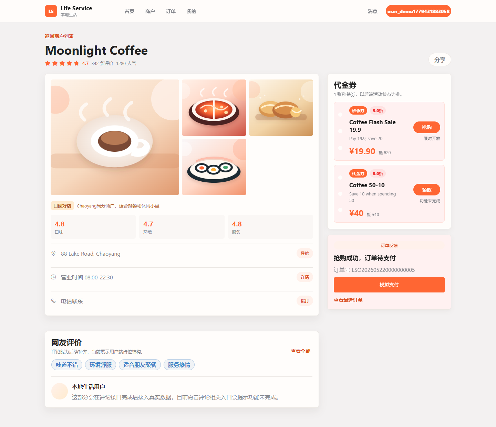
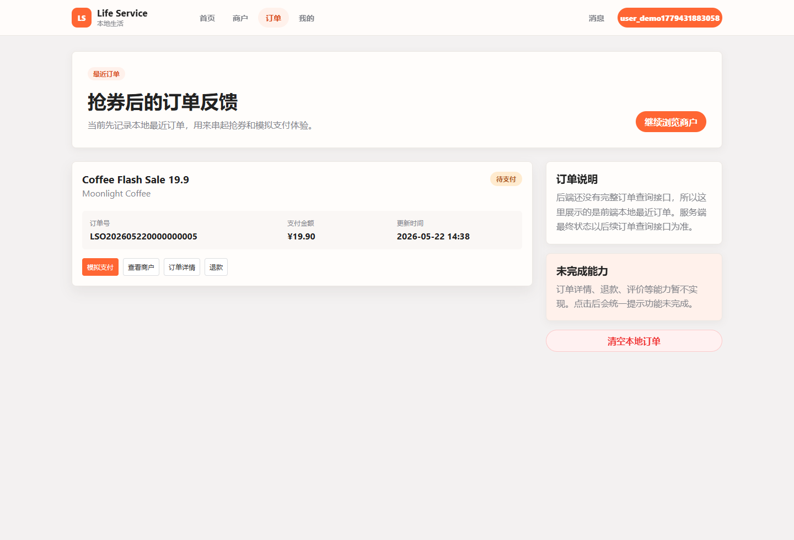
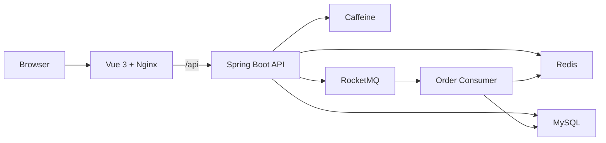

# Life Service

[English](README.md) | [简体中文](README.zh-CN.md) | [日本語](README.ja-JP.md)

[](https://github.com/1ike-m0on/life-service/actions/workflows/ci.yml)
[](https://github.com/1ike-m0on/life-service/actions/workflows/docker-publish.yml)

Life Service は、Java 21、Spring Boot 3.5、Vue 3、Redis、MySQL、
RocketMQ を使ったローカルライフサービス向けの full-stack scaffold です。

単なる API テスト画面ではなく、ユーザーが店舗を探し、クーポンを確認し、
秒殺クーポンを取得し、注文状態を確認できる、プロダクト寄りのプロトタイプを目指しています。

## Screenshots

| Home | Merchant Detail |
| --- | --- |
|  |  |

| Flash-sale Claim | Orders |
| --- | --- |
|  |  |

## Features

- ユーザー向けのローカルライフ PC Web 体験
- 店舗一覧、店舗詳細、クーポン一覧、秒殺クーポン取得、注文ページ
- メールログインと Redis Token 認証
- Redis + Caffeine による多段キャッシュ
- DB 更新後のキャッシュ削除と、削除失敗時のローカルタスク補償
- 秒殺クーポンの起動時ウォームアップと fail-closed な入口
- Redis Lua による在庫と一人一注文の原子判定
- RocketMQ による非同期注文作成
- 未払い注文の自動クローズと在庫解放リトライ
- 支払いコールバックを模した paid/closed 状態処理
- Redis ZSet + Lua によるスライディングウィンドウレート制限
- traceId 付きリクエストログと Actuator ヘルスチェック
- Docker Compose でフロントエンド、バックエンド、ミドルウェアを一括起動

## Architecture



More details:

- [Architecture notes](ARCHITECTURE.md)
- [Benchmark summary](BENCHMARK.md)
- [Deployment guide](DEPLOYMENT.md)

## Tech Stack

| Layer | Stack |
| --- | --- |
| Backend | Java 21, Spring Boot 3.5, MyBatis-Plus |
| Frontend | Vue 3, Vite, Pinia, Axios |
| Database | MySQL 8, Flyway |
| Cache | Redis, Caffeine |
| Messaging | RocketMQ |
| Gateway | Nginx |
| Delivery | Docker Compose, GitHub Actions |

## Quick Start

Requirements:

- Docker Desktop または Docker Engine

リポジトリのルートで以下を実行します。

```bash
docker compose up -d --build
```

Open:

| Service | URL |
| --- | --- |
| Frontend | http://localhost:8080 |
| Backend health | http://localhost:8081/actuator/health |
| MySQL | localhost:3307 |
| Redis | localhost:6379 |
| RocketMQ NameServer | localhost:9876 |

停止:

```bash
docker compose down
```

ローカルデータを削除:

```bash
docker compose down -v
```

ポート、リソース制限、RocketMQ Dashboard、開発用ミドルウェア構成、公開イメージでの起動は
[DEPLOYMENT.md](DEPLOYMENT.md) を参照してください。

## Demo Account

Docker demo profile では Flyway によってデモデータが投入され、
起動時に利用可能な秒殺クーポンが Redis にウォームアップされます。

```text
demo2001@life.local
```

ログイン後は Redis Token が発行され、認証が必要な API では以下を利用します。

```http
Authorization: Bearer {token}
```

## Demo Flow

1. Docker Compose でスタックを起動します。
2. `http://localhost:8080` を開きます。
3. デモメールでログインします。
4. ホーム画面で店舗を閲覧します。
5. 店舗詳細ページでクーポンを確認します。
6. 秒殺クーポンを取得します。
7. 注文ページで注文状態を確認します。
8. 模擬支払い操作で paid/closed の状態分岐を確認します。

在庫不足、重複取得、秒殺ホットデータ未準備、レート制限などは、
UI 上で通常のビジネスフィードバックとして表示されます。

## Project Layout

```text
.
|-- frontend/                 # Vue 3 PC frontend
|-- src/main/java/io/github/ikemoon/lifeservice
|   |-- common/               # API response, exception, logging, auth
|   |-- infrastructure/       # cache, id generator, rate limit
|   |-- merchant/             # merchant category and merchant query
|   |-- voucher/              # voucher query and flash-sale warmup
|   |-- order/                # flash-sale order, close, payment, stock release
|   `-- user/                 # email login and token auth
|-- src/main/resources/db/    # Flyway migrations and demo data
|-- deploy/                   # compose templates and env examples
|-- compose.yaml              # full local demo stack
|-- ARCHITECTURE.md           # architecture notes
|-- BENCHMARK.md              # benchmark summary
`-- DEPLOYMENT.md             # deployment guide
```

## Roadmap

- 実決済ゲートウェイ連携
- 決済トランザクションと返金レコード
- MQ ベースの支払い/クローズ補償
- 店舗とクーポンの管理画面
- Prometheus/Grafana 監視
- 複数インスタンス構成の検証
- Gateway レベルの流量制御とリスク対策

## Scope

Life Service は、学習、デモ、継続開発のための scaffold です。
実際に触れるローカルライフのプロダクト体験とバックエンド設計パターンを重視していますが、
現時点では本番レベルの高可用商用システムではありません。
