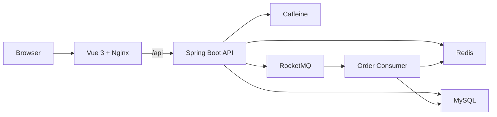

# Life Service

[English](README.md) | [简体中文](README.zh-CN.md) | [日本語](README.ja-JP.md)

[](https://github.com/1ike-m0on/life-service/actions/workflows/ci.yml)
[](https://github.com/1ike-m0on/life-service/actions/workflows/docker-publish.yml)

Life Service は Java 21、Spring Boot 3.5、Vue 3、MySQL、Redis、RocketMQ を使ったローカルライフサービス向けのフルスタック scaffold です。

単なる API テスト画面ではなく、実際に触れるプロダクトプロトタイプを目指しています。起動後、ユーザーは店舗を閲覧し、クーポンを確認し、秒殺クーポンを取得し、注文状態や簡易的な支払い・自動クローズの流れを体験できます。

## For Reviewers

- Local start: `docker compose up -d --build`
- Open UI: `http://localhost:8080`
- Demo account: `demo2001@life.local`
- Main demo path: merchant browsing -> voucher detail -> flash-sale claim -> order -> simulated payment / auto-close
- Engineering focus: Redis Lua qualification, RocketMQ async order creation, cache invalidation retry, payment/close state protection, Prometheus/Grafana monitoring

## 体験できること

- ユーザー向けの PC ローカルライフ UI
- 店舗一覧、店舗詳細、クーポン表示、業務フィードバック
- メールログインと Redis Token 認証
- 秒殺クーポンのホットデータ事前ロードと fail-closed 保護
- RocketMQ による非同期注文作成
- 注文一覧、注文状態、模擬支払い、未払い注文の自動クローズ
- 読み取り中心データ向けのキャッシュ最適化
- スライディングウィンドウ方式のレート制限
- Prometheus と Grafana による主要メトリクス監視
- Docker Compose による一括ローカル起動
- Docker Desktop、kind、minikube 向けの Kubernetes ローカルデプロイ基盤

## Project Concept

多くのサンプルプロジェクトは CRUD で終わります。Life Service は、ローカルライフサービスで重要になりやすい一連の流れを扱います。

```text
店舗を見る
  -> クーポンを見る
  -> 秒殺クーポンを取得する
  -> 非同期で注文を作成する
  -> 支払いまたは自動クローズを行う
  -> キャッシュ、レート制限、MQ、監視を確認する
```

学習、面接、ポートフォリオ、さらに大きなプロダクトへの拡張に使えるベースを目指しています。

## Quick Start

Requirements:

- Docker Desktop または Docker Engine

リポジトリのルートで起動します。

```bash
docker compose up -d --build
```

プロダクト UI:

```text
http://localhost:8080
```

主なローカル URL:

| Service | URL |
| --- | --- |
| Frontend | http://localhost:8080 |
| Backend health | http://localhost:8081/actuator/health |
| Backend metrics | http://localhost:8081/actuator/prometheus |
| Prometheus | http://localhost:9090 |
| Grafana | http://localhost:3000 |

停止:

```bash
docker compose down
```

ローカルデータの削除:

```bash
docker compose down -v
```

## Demo Account

demo profile では、サンプルユーザー、店舗、クーポン、秒殺データが初期化されます。

```text
demo2001@life.local
```

ログイン後は Redis Token を使います。

```http
Authorization: Bearer {token}
```

## Demo Flow

1. Docker Compose で起動します。
2. `http://localhost:8080` を開きます。
3. デモメールでログインします。
4. 店舗とローカルライフコンテンツを閲覧します。
5. 店舗詳細ページを開きます。
6. 秒殺クーポンを取得します。
7. 作成された注文を確認します。
8. 模擬支払い、または自動クローズを確認します。
9. Grafana でバックエンドメトリクスを確認します。

在庫切れ、重複取得、ホットデータ未準備、レート制限などは、通常のプロダクトフィードバックとして表示されます。

## Technical Highlights



- Redis + Caffeine の多段キャッシュ
- キャッシュ削除失敗時のローカルリトライ補償
- 秒殺ホットデータの起動時ウォームアップ
- Redis Lua による在庫、一人一注文、活動状態の原子的判定
- RocketMQ による非同期注文作成
- MQ 送信失敗時の Redis 資格ロールバック
- 未払い注文の自動クローズと在庫解放リトライ
- 支払いとクローズの競合に対する状態保護
- trace ログと Micrometer メトリクス
- GitHub Actions CI と Docker イメージ公開

More details:

- [Architecture notes](ARCHITECTURE.md)
- [Benchmark summary](BENCHMARK.md)
- [Deployment guide](DEPLOYMENT.md)
- [Kubernetes runbook](deploy/k8s/README.md)

## Tech Stack

| Layer | Stack |
| --- | --- |
| Backend | Java 21, Spring Boot 3.5, MyBatis-Plus |
| Frontend | Vue 3, Vite, Pinia, Axios, Nginx |
| Database | MySQL 8, Flyway |
| Cache | Redis, Caffeine |
| Messaging | RocketMQ |
| Monitoring | Spring Boot Actuator, Micrometer, Prometheus, Grafana |
| Delivery | Docker Compose, Kubernetes, GitHub Actions |

## Project Layout

```text
.
|-- frontend/                 # Vue 3 frontend
|-- src/main/java/io/github/ikemoon/lifeservice
|   |-- common/               # API response, exception, logging, auth
|   |-- infrastructure/       # cache, ID generation, rate limit
|   |-- merchant/             # merchant query
|   |-- voucher/              # voucher query and flash-sale warmup
|   |-- order/                # order, payment, close, stock release
|   `-- user/                 # login, token auth, user surface
|-- src/main/resources/db/    # Flyway migrations and demo data
|-- deploy/                   # Docker, monitoring, Kubernetes
|-- tests/                    # load-test assets
|-- ARCHITECTURE.md
|-- BENCHMARK.md
`-- DEPLOYMENT.md
```

## Deployment

### Docker Compose

ローカルデモとレビュー用途には Docker Compose を推奨します。

```bash
docker compose up -d --build
```

### Monitoring

```bash
docker compose --profile monitor up -d
```

Grafana は `Life Service Overview` ダッシュボードを自動で読み込みます。

### Kubernetes

ローカル Kubernetes の学習とデプロイ検証用です。

```powershell
.\deploy\k8s\local-rollout.ps1 -Target all -ApplyBase
```

日常的なアプリ更新:

```powershell
.\deploy\k8s\local-rollout.ps1 -Target backend
.\deploy\k8s\local-rollout.ps1 -Target frontend
```

## Scope

Life Service は学習、デモ、継続開発のための scaffold です。ローカルライフサービスの主要なユーザーフローと複数のバックエンドエンジニアリング要素を含んでいますが、現時点では本番向けの高可用商用システムではありません。

今後は、実決済レコード、返金補償、店舗管理、production-grade Kubernetes overlay、ゲートウェイレベルの流量保護などを追加できます。
