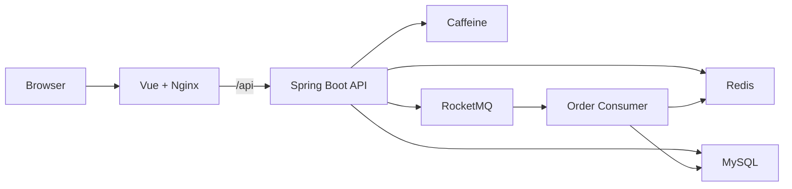
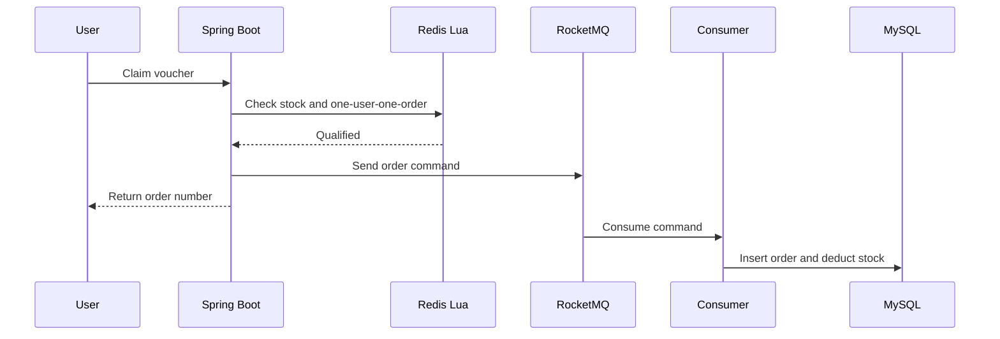
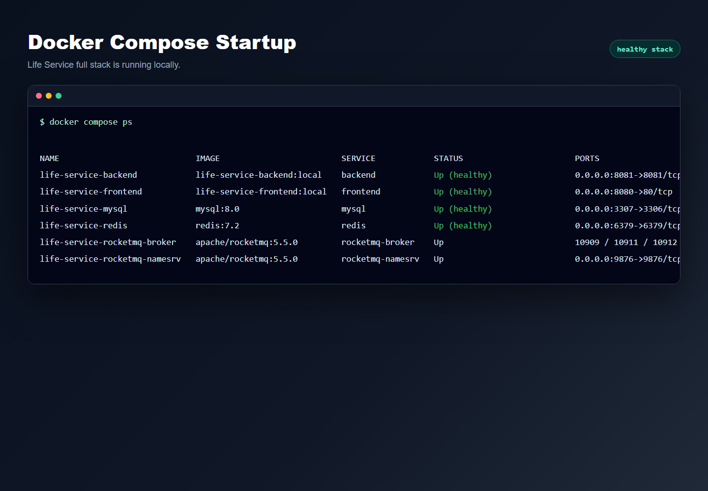
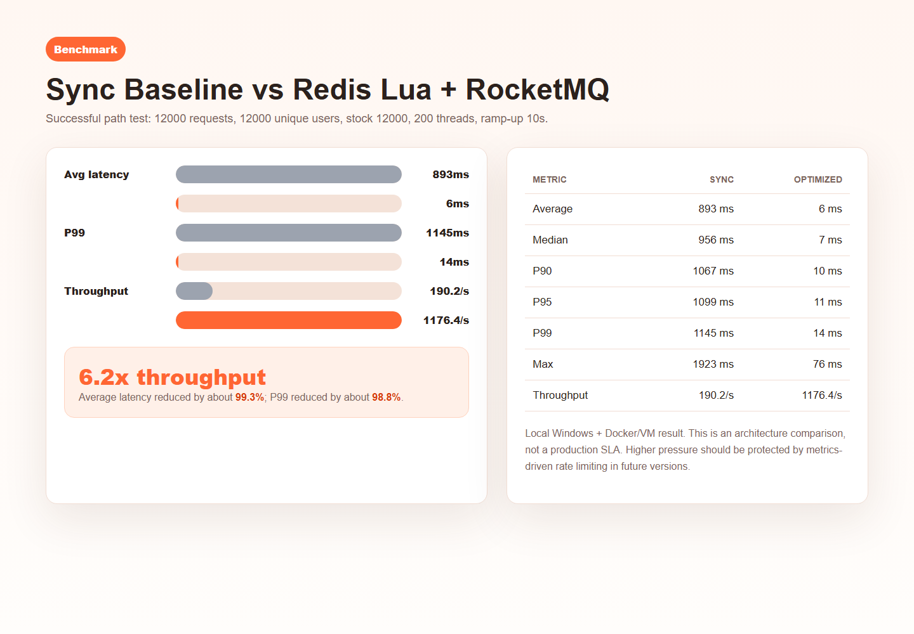

# Life Service

一个基于 Java 21 + Spring Boot 3.5 + Vue 3 的本地生活服务脚手架，围绕商户浏览、优惠券秒杀、异步下单、订单关闭、缓存一致性、限流、登录鉴权和一键部署构建。

项目目标不是复刻完整商业平台，而是提供一个可以直接运行、方便继续扩展的 full-stack scaffold。clone 仓库后可以通过 Docker Compose 启动前端、后端和中间件，体验一个接近真实本地生活平台的核心链路。

## Highlights

- 用户端 PC Web：商户列表、商户详情、优惠券、秒杀下单、订单状态
- 邮箱登录：格式校验登录、Redis Token、`Authorization: Bearer token`
- 多级缓存：Caffeine 本地缓存 + Redis 缓存 + TTL 抖动 + 空值缓存
- 缓存一致性：DB 更新后删除缓存，删除失败写入本地任务表并定时补偿
- 秒杀链路：Redis 热数据预热、Lua 原子资格判断、RocketMQ 异步创建订单
- Fail-closed 秒杀入口：秒杀热数据缺失时直接失败，不回源 MySQL 打热点
- 一人一单与防超卖：Redis Set + Lua 前置校验，数据库唯一索引兜底
- 订单闭环：未支付订单自动关闭，库存释放失败进入重试任务
- 并发状态处理：模拟支付回调与超时关单使用数据库条件更新避免状态覆盖
- 滑动窗口限流：`@RateLimiter` + AOP + Redis ZSet + Lua
- 可观测基础：统一请求 traceId 日志、Actuator 健康检查
- 一键部署：Docker Compose 启动 MySQL、Redis、RocketMQ、后端和前端

## Architecture



秒杀下单主链路：



## Tech Stack

| Layer | Tech |
| --- | --- |
| Backend | Java 21, Spring Boot 3.5.x |
| Persistence | MyBatis-Plus, MySQL 8, Flyway |
| Cache | Redis, Caffeine |
| Messaging | RocketMQ |
| Frontend | Vue 3, Vite, Pinia, Axios, Vant |
| Gateway | Nginx |
| DevOps | Docker Compose, GitHub Actions |
| Test | JUnit 5, Mockito |

## Quick Start

只需要安装 Docker Desktop 或 Docker Engine。

```bash
docker compose up -d --build
```

启动后访问：

| Service | URL |
| --- | --- |
| Frontend | http://localhost:8080 |
| Backend Health | http://localhost:8081/actuator/health |
| MySQL | localhost:3307 |
| Redis | localhost:6379 |
| RocketMQ NameServer | localhost:9876 |

停止服务：

```bash
docker compose down
```

清空本地数据：

```bash
docker compose down -v
```

更多部署说明见 [DEPLOYMENT.md](DEPLOYMENT.md)。

## Screenshots

| Home | Merchant Detail |
| --- | --- |
|  |  |

| Flash-sale Claim | Orders |
| --- | --- |
|  |  |

| Docker Compose Startup | Benchmark Comparison |
| --- | --- |
|  |  |

## Demo Account

Docker demo 环境会通过 Flyway 初始化商户、优惠券、秒杀券和测试用户。

```text
demo2001@life.local
```

登录后前端会保存 Redis Token，并在需要鉴权的接口中自动携带：

```http
Authorization: Bearer {token}
```

## Demo Flow

Reviewer 可以按下面的路径体验核心功能：

1. Start the full stack.

```bash
docker compose up -d --build
```

2. Open the frontend.

```text
http://localhost:8080
```

3. Log in with the demo account.

```text
demo2001@life.local
```

4. Browse merchant categories and merchant cards on the home page.

5. Open a merchant detail page and check the available vouchers.

6. Claim a flash-sale voucher.

Expected business feedback:

```text
success: returns an order number
stock insufficient: returns a normal business failure
duplicate claim: returns a normal business failure
hot data not ready: fail closed instead of querying MySQL
rate limited: returns a traffic protection message
```

7. Open the orders page and check the order status.

8. Use the simulated payment action to verify paid / closed state handling.

9. Check backend health.

```text
http://localhost:8081/actuator/health
```

## Feature Overview

### Merchant and Voucher

- 商户分类查询
- 商户列表分页查询
- 商户详情查询
- 商户优惠券列表
- 商户详情缓存
- PC 用户端浏览体验

### Cache

- Redis cache-aside 查询封装
- Caffeine + Redis 二级缓存
- 缓存空值防穿透
- TTL 随机抖动防雪崩
- DB 更新后删除缓存
- 缓存删除失败本地任务表补偿

### Flash Sale

- 秒杀券启动预热
- 秒杀入口只读 Redis 热数据
- Redis Lua 原子判断库存和一人一单
- 订单号由 Redis 当日递增序列生成
- RocketMQ 异步下单
- MQ 发送失败回滚 Redis 资格
- Consumer 异步写入订单并扣减 MySQL 库存
- 数据库唯一索引兜底防重复订单

### Order

- 待支付订单超时自动关闭
- 关单后释放 Redis 和 MySQL 库存
- 库存释放失败进入重试任务
- 多次失败后保留失败记录
- 模拟支付接口验证支付与关单并发
- 支付成功、重复支付、订单已关闭等状态分支

### Rate Limit and Logging

- 注解式限流：`@RateLimiter`
- 支持 `GLOBAL`、`IP`、`USER` 三种维度
- Redis ZSet + Lua 实现滑动窗口
- 普通查询 Redis 异常时 fail open
- 秒杀入口 Redis 异常时 fail closed
- 请求 traceId 写入日志 MDC

## Benchmark

The benchmark data below is from a local Windows + Docker/VM development
environment. It compares the old synchronous order path with the final warmup
version of the Redis Lua + RocketMQ path. The goal is to show the effect of
removing database operations from the request hot path, not to claim a
production SLA.

### Sync Baseline vs Optimized Path

Test scenario:

```text
scenario: successful order path
total requests: 12000
users: 12000 unique users
stock: 12000
threads: 200
ramp-up: 10s
loop count: 60
business exception expectation: 0%
```

This is not a stock-insufficient fast-fail test. It is a successful path test
where all 12000 users can obtain an order qualification.

Baseline endpoint:

```text
POST /api/v1/flash-sale-vouchers/1001/orders/sync-baseline
```

Baseline path:

```text
MySQL voucher query
Redis user lock
MySQL user-order query
MySQL stock deduction
MySQL order insert
```

Optimized endpoint:

```text
POST /api/v1/flash-sale-vouchers/1001/orders
```

Optimized path:

```text
warm up flash-sale hot data
read Redis only in the request path
Redis Lua stock and one-user-one-order qualification
generate order number
send RocketMQ order command
consumer persists order asynchronously
```

| Metric | Sync baseline | Optimized path |
| --- | ---: | ---: |
| Samples | 12000 | 12000 |
| Average latency | 893 ms | 6 ms |
| Median latency | 956 ms | 7 ms |
| P90 | 1067 ms | 10 ms |
| P95 | 1099 ms | 11 ms |
| P99 | 1145 ms | 14 ms |
| Min | 59 ms | not recorded |
| Max | 1923 ms | 76 ms |
| Throughput | 190.2 req/s | 1176.4 req/s |
| Business exception rate | 0.00% | 0.00% |

Improvement:

```text
average latency: 893ms -> 6ms, about 99.3% lower
P90 latency:      1067ms -> 10ms, about 99.1% lower
P95 latency:      1099ms -> 11ms, about 99.0% lower
P99 latency:      1145ms -> 14ms, about 98.8% lower
max latency:      1923ms -> 76ms, about 96.0% lower
throughput:       190.2 req/s -> 1176.4 req/s, about 6.2x higher
```

The old synchronous path performs MySQL voucher query, user-order query, hot-row
stock update, and order insert in the request thread. Under concurrency, the
stock update becomes the main bottleneck because all requests compete for the
same MySQL row lock.

The optimized path relies on warmup data, reads Redis only in the request path,
uses Lua for stock qualification and one-user-one-order checks, then sends an
order command to RocketMQ. The request thread no longer performs MySQL queries,
hot-row stock deduction, or synchronous order insertion.

The business exception rate is shown only to indicate that this test is a
successful-path comparison. In real load testing, whether a request should be
classified as failed depends on the scenario-specific latency threshold, not
only on HTTP or business error codes.

### Current Local Capacity Observation

In the current local environment, the most stable result appears around
1000-1100+ req/s for the core flash-sale path. When the target pressure is pushed
higher, latency and tail latency rise quickly, which indicates that the local
single-instance stack or the pressure client starts to queue.

Therefore, the current conclusion is conservative:

```text
verified: around 1000-1100+ req/s local flash-sale success path with low latency
not claimed: stable 3000+ req/s or production-grade high availability
```

Future versions should add metrics and protection automation:

```text
1. monitor core endpoint latency, P95/P99, error rate, and MQ backlog
2. trigger stricter rate limits when latency rises abnormally
3. protect successful core traffic during overload
4. expose metrics through Prometheus / Grafana
5. validate multi-instance deployment instead of relying on a single local node
```

## API Overview

| Method | Path | Description |
| --- | --- | --- |
| `GET` | `/api/v1/merchant-categories` | List merchant categories |
| `GET` | `/api/v1/merchants` | Page merchants |
| `GET` | `/api/v1/merchants/{id}` | Get merchant detail |
| `GET` | `/api/v1/merchants/{merchantId}/vouchers` | List vouchers |
| `POST` | `/api/v1/auth/login` | Email login |
| `GET` | `/api/v1/auth/me` | Current user |
| `POST` | `/api/v1/auth/logout` | Logout |
| `POST` | `/api/v1/flash-sale-vouchers/{voucherId}/warmup` | Warm up flash-sale voucher |
| `POST` | `/api/v1/flash-sale-vouchers/{voucherId}/orders` | Create flash-sale order |
| `POST` | `/api/v1/voucher-orders/{orderNo}/payment` | Simulate payment callback |

登录示例：

```http
POST /api/v1/auth/login
Content-Type: application/json

{
  "email": "demo2001@life.local"
}
```

秒杀下单示例：

```http
POST /api/v1/flash-sale-vouchers/1001/orders
Authorization: Bearer {token}
```

## Local Development

如果希望在宿主机运行后端和前端，只启动中间件：

```bash
docker compose --env-file deploy/.env -f deploy/docker-compose.dev.yml up -d
```

启动后端：

```bash
mvn spring-boot:run
```

启动前端：

```bash
cd frontend
corepack enable
corepack prepare pnpm@10.11.0 --activate
pnpm install
pnpm run dev
```

Vite 默认地址：

```text
http://localhost:5173
```

开发环境中 `/api` 会代理到：

```text
http://localhost:8081
```

## Test

后端测试：

```bash
mvn test
```

前端类型检查与构建：

```bash
cd frontend
pnpm run build
```

当前测试覆盖：

- 缓存客户端
- 缓存删除补偿
- Redis 订单号生成
- 商户查询缓存
- 秒杀 Lua 资格判断
- MQ 发布与消费
- 启动预热
- 超时关单
- 库存释放补偿
- 支付和关单并发
- 滑动窗口限流
- 登录鉴权
- 请求 trace 日志

## Project Structure

```text
.
├── frontend/                 # Vue 3 PC frontend
├── src/main/java/io/github/ikemoon/lifeservice
│   ├── common                # API response, exception, logging, auth
│   ├── infrastructure        # cache, id, rate limit
│   ├── merchant              # merchant query
│   ├── voucher               # voucher and flash-sale warmup
│   ├── order                 # flash-sale order, close, payment, stock release
│   └── user                  # email login and token auth
├── src/main/resources/db     # Flyway migrations and demo data
├── deploy/                   # development and production compose templates
├── compose.yaml              # full local demo stack
├── Dockerfile                # backend image
└── DEPLOYMENT.md             # deployment guide
```

## CI/CD

GitHub Actions currently checks:

- Maven test
- Frontend build
- Docker image build
- Docker Compose config validation

The repository also includes a Docker publish workflow for GHCR images:

- `ghcr.io/1ike-m0on/life-service-backend`
- `ghcr.io/1ike-m0on/life-service-frontend`

## Roadmap

- Real payment gateway integration
- Payment transaction table and refund order
- Refund compensation workflow
- Admin-side merchant and voucher management
- MQ-based close/payment compensation
- Prometheus and Grafana monitoring
- Multi-instance deployment verification
- Gateway-level rate limiting and risk control

## Scope

This project is a local-life service scaffold for learning, demonstration, and continued development. It is not a production-ready high-availability commercial system yet.

The current version is suitable for demonstrating:

- full-stack local-life product prototype
- Redis cache and consistency patterns
- Redis Lua flash-sale qualification
- RocketMQ asynchronous order creation
- unpaid order auto-close
- payment/close concurrency handling
- Docker Compose one-command startup
