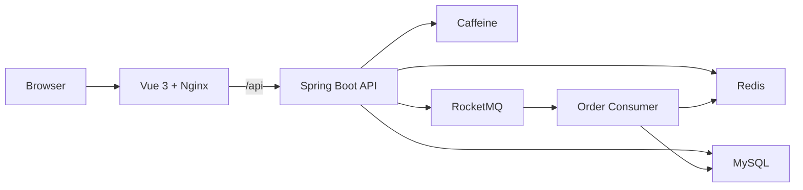

# Life Service

[English](README.md) | [简体中文](README.zh-CN.md) | [日本語](README.ja-JP.md)

[](https://github.com/1ike-m0on/life-service/actions/workflows/ci.yml)
[](https://github.com/1ike-m0on/life-service/actions/workflows/docker-publish.yml)

Life Service is a full-stack local-life service scaffold built with Java 21, Spring Boot 3.5, Vue 3, MySQL, Redis, and RocketMQ.

It is designed to feel like a usable local-life product prototype, not a raw API playground. After starting the project, users can browse merchants, read local-life content, view vouchers, claim flash-sale offers, check orders, and try the basic payment and auto-close flow.

## For Reviewers

- Start locally: `docker compose up -d --build`
- Open UI: `http://localhost:8080`
- Demo account: `demo2001@life.local`
- Main demo path: merchant browsing -> voucher detail -> flash-sale claim -> order -> simulated payment / auto-close
- Engineering focus: Redis Lua qualification, RocketMQ async order creation, cache invalidation retry, payment/close state protection, Prometheus/Grafana monitoring

## What You Can Experience

- Merchant discovery with a PC-friendly local-life interface
- Merchant detail pages with vouchers and product-like feedback
- Email login with Redis-backed token authentication
- Flash-sale voucher claiming with hot-data warmup and fail-closed behavior
- Order creation through RocketMQ asynchronous processing
- Order list, order status, simulated payment, and unpaid order auto-close
- Cache optimization for read-heavy merchant and voucher data
- Sliding-window rate limiting for traffic protection
- Prometheus and Grafana monitoring for key backend metrics
- Docker Compose one-command local deployment
- Kubernetes local deployment foundation for Docker Desktop, kind, or minikube

## Quick Start

Requirements:

- Docker Desktop or Docker Engine

Start the full local stack:

```bash
docker compose up -d --build
```

Open the product UI:

```text
http://localhost:8080
```

Useful local endpoints:

| Service | URL |
| --- | --- |
| Frontend | http://localhost:8080 |
| Backend health | http://localhost:8081/actuator/health |
| Backend metrics | http://localhost:8081/actuator/prometheus |
| Prometheus | http://localhost:9090 |
| Grafana | http://localhost:3000 |

Stop the stack:

```bash
docker compose down
```

Reset local data:

```bash
docker compose down -v
```

## Demo Account

The demo profile initializes sample users, merchants, vouchers, and flash-sale data.

```text
demo2001@life.local
```

Login uses a Redis-backed token:

```http
Authorization: Bearer {token}
```

## Demo Flow

1. Start the stack with Docker Compose.
2. Open `http://localhost:8080`.
3. Log in with the demo email.
4. Browse merchants and local-life content.
5. Open a merchant detail page.
6. Claim a flash-sale voucher.
7. Check the generated order.
8. Try simulated payment or wait for auto-close.
9. Open Grafana to observe backend metrics.

Business states such as stock exhausted, duplicate claim, hot data missing, and rate limiting are returned as normal product feedback.

## Technical Highlights



- Redis + Caffeine multi-level cache for merchant and voucher reads
- Cache invalidation retry task for eventual consistency
- Flash-sale hot-data warmup at startup
- Redis Lua qualification for stock, one-user-one-order, and activity checks
- RocketMQ asynchronous order creation
- Redis rollback when order publishing fails after qualification
- Unpaid order auto-close with stock release retry
- Payment/close state protection with conditional updates
- Request trace logging and Micrometer metrics
- GitHub Actions CI and Docker image publishing

More details:

- [Architecture notes](ARCHITECTURE.md)
- [Benchmark summary](BENCHMARK.md)
- [Deployment guide](DEPLOYMENT.md)
- [Kubernetes runbook](deploy/k8s/README.md)

## Tech Stack

| Layer | Stack |
| --- | --- |
| Backend | Java 21, Spring Boot 3.5, MyBatis-Plus |
| Frontend | Vue 3, Vite, Pinia, Axios, Nginx |
| Database | MySQL 8, Flyway |
| Cache | Redis, Caffeine |
| Messaging | RocketMQ |
| Monitoring | Spring Boot Actuator, Micrometer, Prometheus, Grafana |
| Delivery | Docker Compose, Kubernetes, GitHub Actions |

## Project Layout

```text
.
|-- frontend/                 # Vue 3 frontend
|-- src/main/java/io/github/ikemoon/lifeservice
|   |-- common/               # API response, exception, logging, auth
|   |-- infrastructure/       # cache, ID generation, rate limit
|   |-- merchant/             # merchant query
|   |-- voucher/              # voucher query and flash-sale warmup
|   |-- order/                # order, payment, close, stock release
|   `-- user/                 # login, token auth, user surface
|-- src/main/resources/db/    # Flyway migrations and demo data
|-- deploy/                   # Docker, monitoring, Kubernetes
|-- tests/                    # load-test assets
|-- ARCHITECTURE.md
|-- BENCHMARK.md
`-- DEPLOYMENT.md
```

## Deployment Options

### Docker Compose

Recommended for local startup and feature verification:

```bash
docker compose up -d --build
```

### Monitoring Profile

```bash
docker compose --profile monitor up -d
```

Grafana loads the `Life Service Overview` dashboard automatically.

### Kubernetes

For local Kubernetes deployment validation:

```powershell
.\deploy\k8s\local-rollout.ps1 -Target all -ApplyBase
```

For daily app-only updates:

```powershell
.\deploy\k8s\local-rollout.ps1 -Target backend
.\deploy\k8s\local-rollout.ps1 -Target frontend
```

## Scope

Life Service is an extensible local-life service scaffold. It already covers a mostly complete user flow and several backend engineering patterns, but it is not a production-grade high-availability commercial system yet.

Planned extensions include real payment records, refund compensation, richer merchant operations, production Kubernetes overlays, and gateway-level traffic protection.
