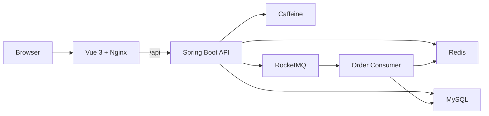

# Life Service

[English](README.md) | [简体中文](README.zh-CN.md) | [日本語](README.ja-JP.md)

[](https://github.com/1ike-m0on/life-service/actions/workflows/ci.yml)
[](https://github.com/1ike-m0on/life-service/actions/workflows/docker-publish.yml)

Life Service is a full-stack local-life service scaffold built with Java 21,
Spring Boot 3.5, Vue 3, Redis, MySQL, and RocketMQ.

It is designed as a polished product prototype rather than a raw API demo:
users can browse merchants, view voucher offers, claim flash-sale vouchers,
check order status, and try the payment/close flow from a PC-friendly frontend.

## Screenshots

| Home | Merchant Detail |
| --- | --- |
|  |  |

| Flash-sale Claim | Orders |
| --- | --- |
|  |  |

## What It Provides

- Consumer-facing local-life web experience
- Merchant discovery, merchant detail, voucher list, flash-sale claim, and order page
- Email login with Redis token authentication
- Redis + Caffeine multi-level cache for read-heavy data
- Cache invalidation with local retry task compensation
- Flash-sale hot data warmup and fail-closed request path
- Redis Lua qualification for stock and one-user-one-order checks
- RocketMQ asynchronous order creation
- Unpaid order auto-close and stock release retry
- Simulated payment callback with paid/closed state handling
- Sliding-window rate limiting based on Redis ZSet + Lua
- Request trace logging, Actuator health, and Prometheus metrics endpoint
- One-command Docker Compose startup for frontend, backend, and middleware
- Optional Prometheus and Grafana monitoring profile

## Architecture At A Glance



More details:

- [Architecture notes](ARCHITECTURE.md)
- [Benchmark summary](BENCHMARK.md), including ★ V2.1 monitored tuning results
- [Deployment guide](DEPLOYMENT.md)

## Tech Stack

| Layer | Stack |
| --- | --- |
| Backend | Java 21, Spring Boot 3.5, MyBatis-Plus |
| Frontend | Vue 3, Vite, Pinia, Axios |
| Database | MySQL 8, Flyway |
| Cache | Redis, Caffeine |
| Messaging | RocketMQ |
| Gateway | Nginx |
| Delivery | Docker Compose, GitHub Actions |

## Quick Start

Requirements:

- Docker Desktop or Docker Engine

Start the full local stack:

```bash
docker compose up -d --build
```

Open:

| Service | URL |
| --- | --- |
| Frontend | http://localhost:8080 |
| Backend health | http://localhost:8081/actuator/health |
| Backend metrics | http://localhost:8081/actuator/prometheus |
| MySQL | localhost:3307 |
| Redis | localhost:6379 |
| RocketMQ NameServer | localhost:9876 |

Stop:

```bash
docker compose down
```

Reset local data:

```bash
docker compose down -v
```

Optional monitoring stack:

```bash
docker compose --profile monitor up -d
```

| Service | URL |
| --- | --- |
| Prometheus | http://localhost:9090 |
| Grafana | http://localhost:3000 |

Default Grafana login is `admin` / `admin` for local demo use.
Grafana auto-loads the `Life Service Overview` dashboard from the repository.

Useful Prometheus metric names for the current demo:

```text
life_flash_sale_request_total
life_flash_sale_success_total
life_flash_sale_stock_not_enough_total
life_flash_sale_duplicate_total
life_flash_sale_not_ready_total
life_cache_delete_task_pending
life_order_close_success_total
life_stock_release_failure_total
life_rate_limit_rejected_total
```

Reusable local load-test assets are available under `tests/load/jmeter`. They
include a parameterized JMeter plan, token CSV preparation scripts, and reset SQL
for repeatable flash-sale benchmark runs.

See [DEPLOYMENT.md](DEPLOYMENT.md) for ports, resource limits, optional
RocketMQ dashboard, development middleware mode, and published image mode.

## Demo Account

The Docker demo profile loads seed data and warms eligible flash-sale vouchers
into Redis at startup.

```text
demo2001@life.local
```

The login flow stores a Redis-backed token and uses:

```http
Authorization: Bearer {token}
```

## Demo Flow

1. Start the stack with Docker Compose.
2. Open `http://localhost:8080`.
3. Log in with the demo email.
4. Browse merchants from the home page.
5. Open a merchant detail page and review vouchers.
6. Claim a flash-sale voucher.
7. Check the order page.
8. Try simulated payment and observe paid/closed behavior.

Business feedback such as stock insufficient, duplicate claim, hot data not
ready, and rate limiting is returned as normal product feedback in the UI.

## Project Layout

```text
.
|-- frontend/                 # Vue 3 PC frontend
|-- src/main/java/io/github/ikemoon/lifeservice
|   |-- common/               # API response, exception, logging, auth
|   |-- infrastructure/       # cache, id generator, rate limit
|   |-- merchant/             # merchant category and merchant query
|   |-- voucher/              # voucher query and flash-sale warmup
|   |-- order/                # flash-sale order, close, payment, stock release
|   `-- user/                 # email login and token auth
|-- src/main/resources/db/    # Flyway migrations and demo data
|-- deploy/                   # compose templates and environment examples
|-- compose.yaml              # one-command local demo stack
|-- ARCHITECTURE.md           # architecture notes
|-- BENCHMARK.md              # benchmark summary
`-- DEPLOYMENT.md             # deployment guide
```

## Roadmap

- Real payment gateway integration
- Payment transaction and refund records
- MQ-based close/payment compensation
- Admin-side merchant and voucher management
- Grafana dashboards and alert rules
- Multi-instance deployment verification
- Gateway-level traffic protection and risk control

## Scope

Life Service is a scaffold for learning, demonstration, and continued
development. It focuses on a realistic local-life product flow and several
backend engineering patterns, but it is not yet a production-ready,
high-availability commercial system.
