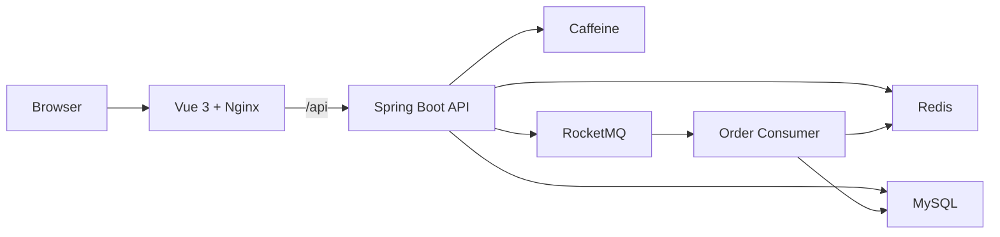

# Life Service

[English](README.md) | [简体中文](README.zh-CN.md) | [日本語](README.ja-JP.md)

[](https://github.com/1ike-m0on/life-service/actions/workflows/ci.yml)
[](https://github.com/1ike-m0on/life-service/actions/workflows/docker-publish.yml)

Life Service 是一个基于 Java 21、Spring Boot 3.5、Vue 3、MySQL、Redis 和 RocketMQ 的本地生活服务脚手架。

它不是单纯的接口测试台，而是一个可以直接体验的本地生活产品原型。启动项目后，用户可以浏览商户、阅读本地生活内容、查看优惠券、参与秒杀抢券、查看订单，并体验基础的支付与超时关单流程。

## 给评审者的 30 秒指南

- 本地启动：`docker compose up -d --build`
- 打开界面：`http://localhost:8080`
- 演示账号：`demo2001@life.local`
- 主体验路径：浏览商户 -> 查看优惠券详情 -> 秒杀抢券 -> 查看订单 -> 模拟支付 / 自动关单
- 工程重点：Redis Lua 资格判断、RocketMQ 异步下单、缓存删除失败补偿、支付/关单状态保护、Prometheus/Grafana 监控

## 可以体验什么

- 面向用户端的本地生活 PC Web 界面
- 商户浏览、商户详情、优惠券展示和业务反馈
- 邮箱登录与 Redis Token 鉴权
- 秒杀券启动预热、热数据校验和 fail-closed 保护
- RocketMQ 异步创建订单
- 订单列表、订单状态、模拟支付和未支付订单自动关闭
- 面向读多写少场景的缓存优化
- 滑动窗口限流保护
- Prometheus 和 Grafana 监控核心后端指标
- Docker Compose 一键启动完整本地环境
- 面向 Docker Desktop、kind、minikube 的本地 Kubernetes 部署基础

## 项目定位

很多示例项目只停留在 CRUD。Life Service 更关注本地生活系统里真正有代表性的业务链路：

```text
浏览商户
  -> 查看优惠券
  -> 秒杀抢券
  -> 异步创建订单
  -> 支付或超时关单
  -> 观察缓存、限流、MQ 和监控行为
```

它适合作为学习项目、面试展示、作品集项目，以及继续扩展成更完整产品的基础工程。

## 快速启动

前置要求：

- Docker Desktop 或 Docker Engine

在项目根目录启动完整环境：

```bash
docker compose up -d --build
```

打开产品界面：

```text
http://localhost:8080
```

常用本地地址：

| 服务 | 地址 |
| --- | --- |
| 前端 | http://localhost:8080 |
| 后端健康检查 | http://localhost:8081/actuator/health |
| 后端监控指标 | http://localhost:8081/actuator/prometheus |
| Prometheus | http://localhost:9090 |
| Grafana | http://localhost:3000 |

停止服务：

```bash
docker compose down
```

清空本地数据：

```bash
docker compose down -v
```

## 演示账号

demo profile 会初始化示例用户、商户、优惠券和秒杀数据。

```text
demo2001@life.local
```

登录后使用 Redis Token：

```http
Authorization: Bearer {token}
```

## 推荐体验流程

1. 使用 Docker Compose 启动项目。
2. 打开 `http://localhost:8080`。
3. 使用演示邮箱登录。
4. 浏览商户和本地生活内容。
5. 进入商户详情页。
6. 参与秒杀抢券。
7. 查看生成的订单。
8. 尝试模拟支付，或等待自动关单。
9. 打开 Grafana 观察后端指标。

库存不足、重复抢券、热数据未准备、限流等状态会作为正常业务反馈展示给用户。

## 技术亮点



- Redis + Caffeine 多级缓存
- 缓存删除失败后的本地任务表补偿
- 秒杀热数据启动预热
- Redis Lua 原子判断库存、一人一单和活动状态
- RocketMQ 异步创建订单
- MQ 发送失败后的 Redis 资格回滚
- 未支付订单自动关闭与库存释放重试
- 支付与关单并发下的状态保护
- 统一 trace 日志和 Micrometer 指标
- GitHub Actions CI 与 Docker 镜像发布

更多说明：

- [架构说明](ARCHITECTURE.md)
- [压测与优化记录](BENCHMARK.md)
- [部署说明](DEPLOYMENT.md)
- [Kubernetes 运行手册](deploy/k8s/README.md)

## 技术栈

| 层级 | 技术 |
| --- | --- |
| 后端 | Java 21, Spring Boot 3.5, MyBatis-Plus |
| 前端 | Vue 3, Vite, Pinia, Axios, Nginx |
| 数据库 | MySQL 8, Flyway |
| 缓存 | Redis, Caffeine |
| 消息队列 | RocketMQ |
| 监控 | Spring Boot Actuator, Micrometer, Prometheus, Grafana |
| 交付 | Docker Compose, Kubernetes, GitHub Actions |

## 项目结构

```text
.
|-- frontend/                 # Vue 3 前端
|-- src/main/java/io/github/ikemoon/lifeservice
|   |-- common/               # API 响应、异常、日志、鉴权
|   |-- infrastructure/       # 缓存、ID 生成、限流
|   |-- merchant/             # 商户查询
|   |-- voucher/              # 优惠券查询与秒杀预热
|   |-- order/                # 订单、支付、关单、库存释放
|   `-- user/                 # 登录、Token 鉴权、用户端能力
|-- src/main/resources/db/    # Flyway 迁移和演示数据
|-- deploy/                   # Docker、监控、Kubernetes
|-- tests/                    # 压测资源
|-- ARCHITECTURE.md
|-- BENCHMARK.md
`-- DEPLOYMENT.md
```

## 部署方式

### Docker Compose

推荐用于本地演示和评审体验：

```bash
docker compose up -d --build
```

### 监控组件

```bash
docker compose --profile monitor up -d
```

Grafana 会自动加载 `Life Service Overview` 看板。

### Kubernetes

用于本地 Kubernetes 学习和部署验证：

```powershell
.\deploy\k8s\local-rollout.ps1 -Target all -ApplyBase
```

日常只更新应用：

```powershell
.\deploy\k8s\local-rollout.ps1 -Target backend
.\deploy\k8s\local-rollout.ps1 -Target frontend
```

## 边界

Life Service 是一个用于学习、展示和继续扩展的脚手架。它已经覆盖较完整的本地生活用户流程和多项后端工程能力，但目前还不是生产级高可用商业系统。

后续可以继续补充真实支付流水、退款补偿、商户运营管理、生产级 Kubernetes overlay，以及网关级流量保护。
