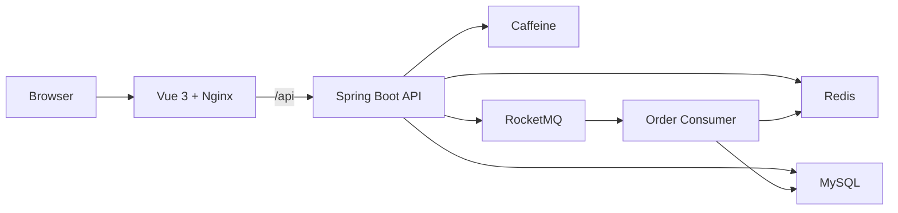

# Life Service

[English](README.md) | [简体中文](README.zh-CN.md) | [日本語](README.ja-JP.md)

[](https://github.com/1ike-m0on/life-service/actions/workflows/ci.yml)
[](https://github.com/1ike-m0on/life-service/actions/workflows/docker-publish.yml)

Life Service 是一个基于 Java 21、Spring Boot 3.5、Vue 3、Redis、MySQL
和 RocketMQ 的本地生活服务脚手架。

它不是单纯的接口测试台，而是一个偏产品化的 full-stack prototype：
用户可以浏览商户、查看优惠券、参与秒杀抢券、查看订单状态，并体验支付与超时关单的基础流程。

## 界面预览

| 首页 | 商户详情 |
| --- | --- |
|  |  |

| 秒杀抢券 | 订单页 |
| --- | --- |
|  |  |

## 功能概览

- 面向用户端的本地生活 PC Web 体验
- 商户浏览、商户详情、优惠券列表、秒杀抢券、订单页
- 邮箱登录与 Redis Token 鉴权
- Redis + Caffeine 多级缓存，面向读多写少数据
- DB 更新后删除缓存，删除失败进入本地任务表补偿
- 秒杀券热数据启动预热，入口 fail closed
- Redis Lua 原子判断库存与一人一单
- RocketMQ 异步创建订单
- 未支付订单自动关闭与库存释放重试
- 模拟支付回调，处理支付与关单并发状态
- Redis ZSet + Lua 实现滑动窗口限流
- 统一 traceId 日志与 Actuator 健康检查
- Docker Compose 一键启动前端、后端和中间件

## 架构概览



更多说明：

- [架构说明](ARCHITECTURE.md)
- [Benchmark 摘要](BENCHMARK.md)
- [部署指南](DEPLOYMENT.md)

## 技术栈

| 层级 | 技术 |
| --- | --- |
| 后端 | Java 21, Spring Boot 3.5, MyBatis-Plus |
| 前端 | Vue 3, Vite, Pinia, Axios |
| 数据库 | MySQL 8, Flyway |
| 缓存 | Redis, Caffeine |
| 消息队列 | RocketMQ |
| 网关 | Nginx |
| 交付 | Docker Compose, GitHub Actions |

## 快速启动

前置要求：

- Docker Desktop 或 Docker Engine

在仓库根目录启动完整本地环境：

```bash
docker compose up -d --build
```

访问地址：

| 服务 | 地址 |
| --- | --- |
| 前端 | http://localhost:8080 |
| 后端健康检查 | http://localhost:8081/actuator/health |
| MySQL | localhost:3307 |
| Redis | localhost:6379 |
| RocketMQ NameServer | localhost:9876 |

停止服务：

```bash
docker compose down
```

清空本地数据：

```bash
docker compose down -v
```

端口、资源限制、RocketMQ Dashboard、开发中间件模式和镜像部署模式见
[DEPLOYMENT.md](DEPLOYMENT.md)。

## 演示账号

Docker demo profile 会通过 Flyway 初始化演示数据，并在应用启动时预热可用的秒杀券热数据。

```text
demo2001@life.local
```

登录后会生成 Redis Token，并在需要鉴权的接口中使用：

```http
Authorization: Bearer {token}
```

## Demo Flow

1. 使用 Docker Compose 启动项目。
2. 打开 `http://localhost:8080`。
3. 使用演示邮箱登录。
4. 在首页浏览商户。
5. 进入商户详情页查看优惠券。
6. 参与秒杀抢券。
7. 在订单页查看订单状态。
8. 使用模拟支付按钮观察已支付、已关闭等状态分支。

库存不足、重复抢券、秒杀热数据未就绪、限流等情况会作为正常业务反馈展示在前端。

## 项目结构

```text
.
|-- frontend/                 # Vue 3 PC 前端
|-- src/main/java/io/github/ikemoon/lifeservice
|   |-- common/               # API 响应、异常、日志、鉴权
|   |-- infrastructure/       # 缓存、ID 生成、限流
|   |-- merchant/             # 商户分类与商户查询
|   |-- voucher/              # 优惠券查询与秒杀预热
|   |-- order/                # 秒杀下单、关单、支付、库存释放
|   `-- user/                 # 邮箱登录与 Token 鉴权
|-- src/main/resources/db/    # Flyway 迁移和演示数据
|-- deploy/                   # Compose 模板和环境变量示例
|-- compose.yaml              # 本地完整演示环境
|-- ARCHITECTURE.md           # 架构说明
|-- BENCHMARK.md              # Benchmark 摘要
`-- DEPLOYMENT.md             # 部署指南
```

## Roadmap

- 接入真实支付网关
- 支付流水表与退款记录
- 基于 MQ 的支付/关单补偿
- 商户与优惠券管理端
- Prometheus/Grafana 监控
- 多实例部署验证
- 网关级限流与风控

## 项目定位

Life Service 是一个用于学习、展示和继续扩展的本地生活服务脚手架。
它关注真实产品流程和后端工程能力展示，但目前还不是生产级高可用商业系统。
